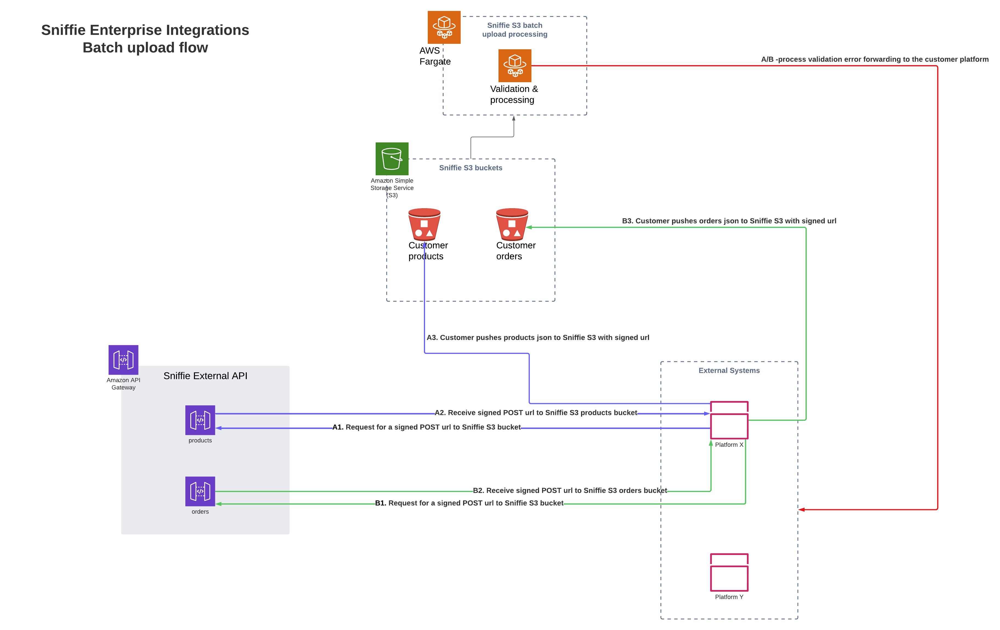

# Bulk transfer to Pricen

Pricen enables the user to do bulk uploads directly to their bulk uploads S3, provided that the user has an account with an api key set up properly. 
With the api key, the user can request a signed url to S3, which they can use to upload a gzipped jsonl file which Pricen will then process further. 
Using the bulk upload is much more cost and time efficient, compared to pushing the same payloads in smaller batches through the rest api. 

## File format: JSONL

Due to the significant performance benefits, which makes streaming easier among other things, we require the files to be pushed in JSON lines file format, which means that the file contains individual json objects, printed on a single line, separated by a line break. 
```
  { "exampleItem": "value 1", "someotherAttribute": true }
  { "exampleItem2": "value 2" }
  { "exampleItem3": "value 3" }
```
## Bulk transfer steps

1. Make sure you have your api key, which enables you to call the Pricen endpoint for the presigned upload url
2. Make a GET request to the endpoint depending on the content type
  - https://api(-staging)sniffie.io/v2/sniffie/bulk-uploads/products-upload-link
  - https://api(-staging)sniffie.io/v2/sniffie/bulk-uploads/orders-upload-link
  - https://api(-staging)sniffie.io/v2/sniffie/bulk-uploads/supplemental-data-upload-link

3. Save the URL which comes as a response
4. Package your payload in the right format into a gzip buffer. 
5. Set the headers to the request, `Content-Encoding` as `gzip` and `Content-Type` as `application/json` or `text/plain` if using `jsonl`
6. Upload the compressed file to the url (see a working code example here)

And then you're done

## Try it out 
In index.ts replace the token value with your own token (which you can get from Pricen). Then either leave the data in index.ts as is, or modify it to your liking and then just.... 
Run `npm run test`

## Documentation

See our openapi spec [bulk-upload-openapi.yaml]

## Architecture
[]
