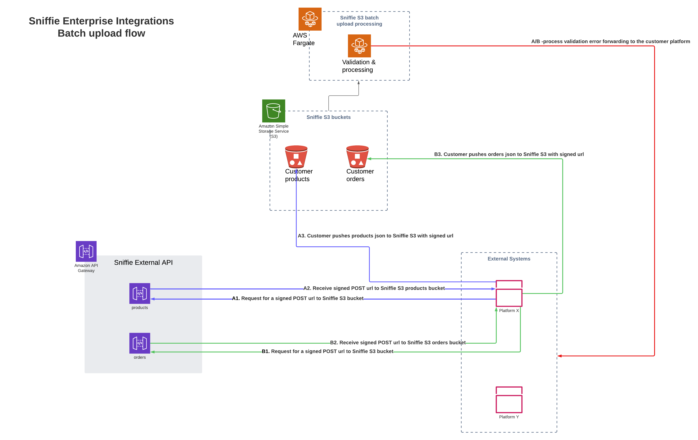

# Bulk transfer to Sniffie

Sniffie enables the user to do bulk uploads directly to their bulk uploads S3, provided that the user has an account with an api key set up properly. 
With the api key, the user can request a signed url to S3, which they can use to upload a gzipped json/jsonl file which Sniffie will then process further. 
Using the bulk upload is much more cost and time efficient, compared to pushing the same payloads in smaller batches through the rest api. 

## Bulk transfer steps

1. Make sure you have your api key, which enables you to call the Sniffie endpoint for the presigned upload url
2. Make a GET request to the endpoint
  
https://api(-staging).sniffie.io/v1/account-products/<replace_with_accountId>/products/bulk-transfer
3. Save the URL which comes as a response
4. Package your payload in the right format into a gzip buffer. 
5. Set the headers to the request, `Content-Encoding` as `gzip` and `Content-Type` as `application/json` or `text/plain` if using `jsonl`
6. Upload the compressed file to the url (see a working code example here)

And then you're done

## Try it out 
In index.ts replace the token value with your own token (which you can get from Sniffie). Then either leave the data in index.ts as is, or modify it to your liking and then just.... 
Run `npm run test`

## Architecture
[]
